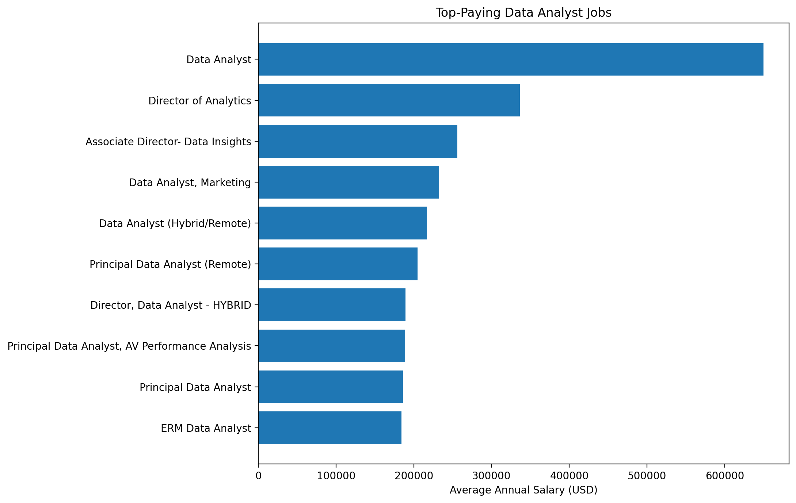
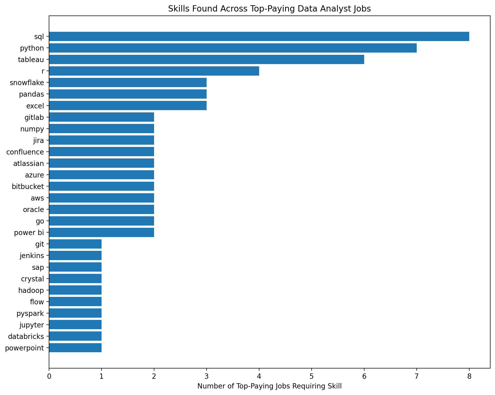
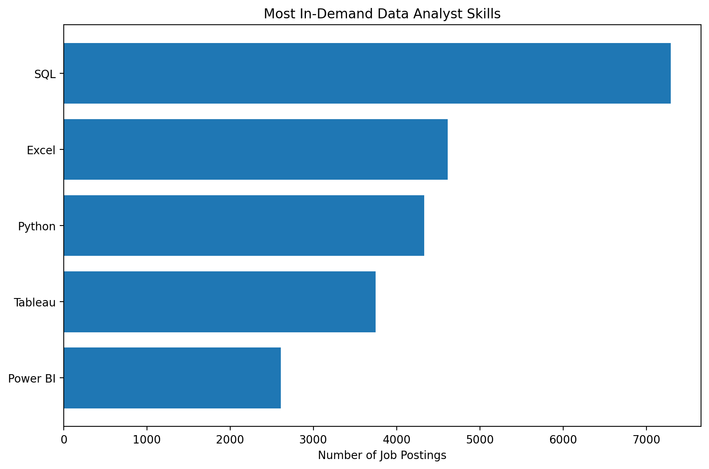
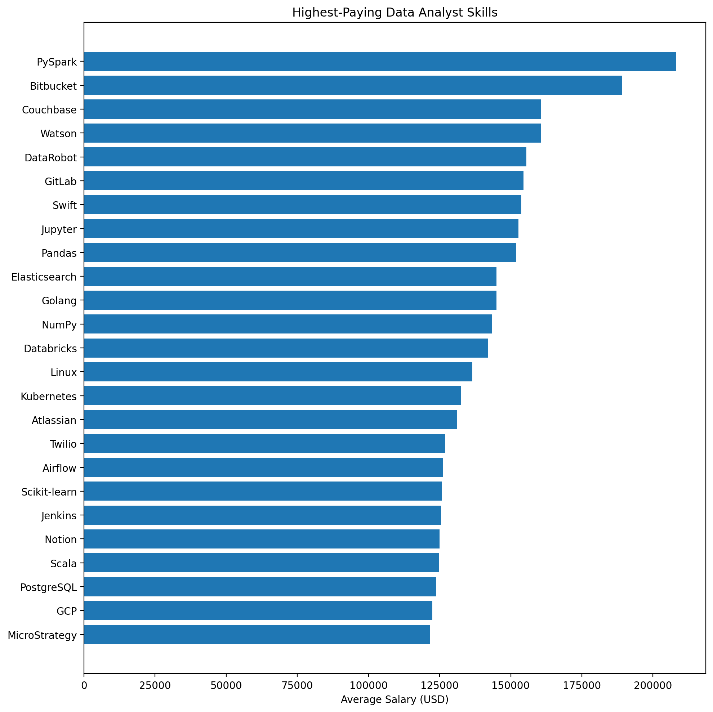
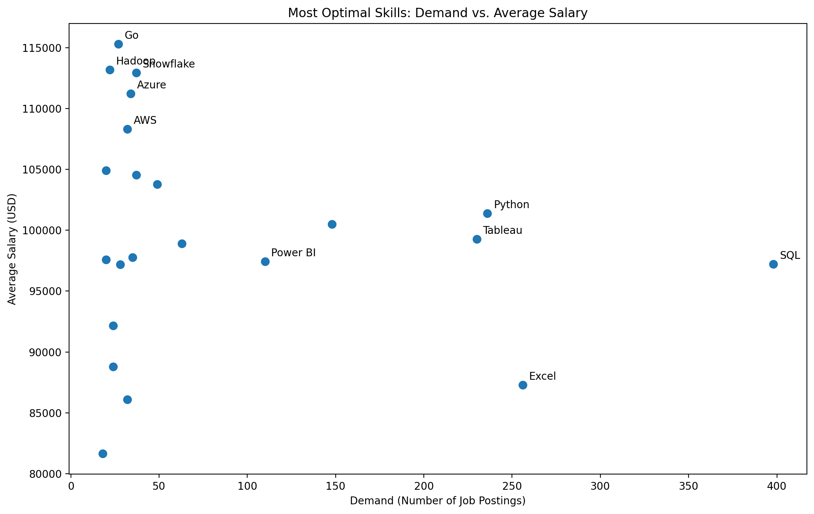

# Data Analyst Job Market Analysis


## 📊 Project Overview


This project analyzes the **Data Analyst job market** to identify the skills, technologies, and qualifications associated with high-paying and in-demand Data Analyst roles.


The analysis is based on job-posting data and focuses on five key perspectives:


1. **Top-Paying Data Analyst Jobs** — identifies the highest-paying positions in the dataset.


2. **Skills Required for Top-Paying Jobs** — examines the technical skills associated with the highest-paying roles.


3. **Most In-Demand Skills** — identifies the skills appearing most frequently across Data Analyst job postings.


4. **Highest-Paying Skills** — compares individual skills based on the average salary associated with jobs requiring them.


5. **Most Optimal Skills** — evaluates skills by considering both their market demand and associated salary, helping identify skills that offer a strong balance between **career opportunity and earning potential**.


The goal is to move beyond simply asking **"Which Data Analyst skills pay the most?"** and instead answer a more practical career question:


> **Which skills provide the best combination of demand and earning potential for someone pursuing a career in Data Analytics?**


SQL Queries? Check them out here


[project_sql folder](/project_sql/)


---


## 📁 Dataset Structure


### 1. Top-Paying Data Analyst Jobs


💻 SQL Query

```sql

SELECT

    job_id,

    job_title,

    job_location,

    job_schedule_type,

    salary_year_avg,

    job_posted_date,

    company_name

FROM job_postings_fact

WHERE job_title_short = 'Data Analyst'

    AND job_location = 'Anywhere'

    AND salary_year_avg IS NOT NULL

ORDER BY salary_year_avg DESC

LIMIT 10;

```


This dataset contains the **10 highest-paying Data Analyst-related positions** identified in the analysis.


Each record includes:


| Field               | Description                                   |


| ------------------- | --------------------------------------------- |


| `job_id`            | Unique identifier for the job posting         |


| `job_title`         | Title of the position                         |


| `job_location`      | Location of the position                      |


| `job_schedule_type` | Employment schedule/type                      |


| `salary_year_avg`   | Average annual salary                         |


| `job_posted_date`   | Date the job was posted                       |


| `company_name`      | Company or organization offering the position |


The dataset demonstrates that high-paying analytics positions extend beyond conventional "Data Analyst" roles and include positions such as **Director, Principal, and Associate Director** roles.





---


### 2. Skills Required for Top-Paying Jobs


💻 SQL Query

```sql

WITH top_paying_jobs AS (

    SELECT

        job_id,

        job_title,

        salary_year_avg

    FROM job_postings_fact

    WHERE job_title_short = 'Data Analyst'

        AND job_location = 'Anywhere'

        AND salary_year_avg IS NOT NULL

    ORDER BY salary_year_avg DESC

    LIMIT 10

)


SELECT

    skills_dim.skills,

    COUNT(*) AS demand_of_skills

FROM top_paying_jobs

INNER JOIN skills_job_dim

    ON top_paying_jobs.job_id = skills_job_dim.job_id

INNER JOIN skills_dim

    ON skills_job_dim.skill_id = skills_dim.skill_id

GROUP BY skills_dim.skills

ORDER BY demand_of_skills DESC;

```


This dataset identifies the skills associated with the high-paying jobs from Dataset 1.


It provides a closer look at the **technical skill combinations found in high-compensation analytics positions**.


Examples include:


* SQL


* Python


* R


* Excel


* Tableau


* Power BI


* Pandas


* PySpark


* AWS


* Azure


* Databricks


* Snowflake


* Jupyter


The data shows that high-paying analytics positions frequently combine **core analytical skills** with **programming, cloud, data engineering, and business intelligence technologies**.





---


### 3. Most In-Demand Data Analyst Skills


💻 SQL Query

```sql

SELECT

    skills_dim.skills,

    COUNT(skills_job_dim.job_id) AS demand_of_skills

FROM job_postings_fact

INNER JOIN skills_job_dim

    ON job_postings_fact.job_id = skills_job_dim.job_id

INNER JOIN skills_dim

    ON skills_job_dim.skill_id = skills_dim.skill_id

WHERE job_postings_fact.job_title_short = 'Data Analyst'

GROUP BY skills_dim.skills

ORDER BY demand_of_skills DESC

LIMIT 5;

```


This dataset ranks skills according to their frequency across the analyzed job postings.


| Rank | Skill    | Demand |


| ---: | -------- | -----: |


|    1 | SQL      |  7,291 |


|    2 | Excel    |  4,611 |


|    3 | Python   |  4,330 |


|    4 | Tableau  |  3,745 |


|    5 | Power BI |  2,609 |


These results highlight the importance of mastering **foundational Data Analyst tools**.


In particular, **SQL has the highest demand by a substantial margin**, followed by Excel, Python, Tableau, and Power BI.





---


### 4. Highest-Paying Skills


💻 SQL Query

```sql

SELECT

    skills_dim.skills,

    ROUND(AVG(job_postings_fact.salary_year_avg), 0) AS avg_salary

FROM job_postings_fact

INNER JOIN skills_job_dim

    ON job_postings_fact.job_id = skills_job_dim.job_id

INNER JOIN skills_dim

    ON skills_job_dim.skill_id = skills_dim.skill_id

WHERE job_postings_fact.job_title_short = 'Data Analyst'

    AND job_postings_fact.salary_year_avg IS NOT NULL

GROUP BY skills_dim.skills

ORDER BY avg_salary DESC

LIMIT 25;

```


This dataset evaluates skills according to the **average salary of jobs requiring those skills**.


Some of the highest-paying skills in the dataset include:


| Skill         | Average Salary |


| ------------- | -------------: |


| PySpark       |       $208,172 |


| Bitbucket     |       $189,155 |


| Couchbase     |       $160,515 |


| Watson        |       $160,515 |


| DataRobot     |       $155,486 |


| GitLab        |       $154,500 |


| Swift         |       $153,750 |


| Jupyter       |       $152,777 |


| Pandas        |       $151,821 |


| Elasticsearch |       $145,000 |


| Golang        |       $145,000 |


| NumPy         |       $143,513 |


| Databricks    |       $141,907 |


This dataset provides insight into the technologies associated with **higher compensation**, particularly skills related to large-scale data processing, cloud/data platforms, machine learning, and advanced analytics.


However, salary alone does not necessarily make a skill the best choice. A skill may have a very high associated salary while appearing in relatively few job postings.





---


## 5. Most Optimal Skills


💻 SQL Query


```sql

WITH skills_demand AS (

    SELECT

        skills_dim.skill_id,

        skills_dim.skills,

        COUNT(skills_job_dim.job_id) AS demand_of_skills

    FROM job_postings_fact

    INNER JOIN skills_job_dim

        ON job_postings_fact.job_id = skills_job_dim.job_id

    INNER JOIN skills_dim

        ON skills_job_dim.skill_id = skills_dim.skill_id

    WHERE job_postings_fact.job_title_short = 'Data Analyst'

        AND job_postings_fact.salary_year_avg IS NOT NULL

    GROUP BY

        skills_dim.skill_id,

        skills_dim.skills

),


average_salary AS (

    SELECT

        skills_dim.skill_id,

        skills_dim.skills,

        ROUND(AVG(job_postings_fact.salary_year_avg), 0) AS avg_salary

    FROM job_postings_fact

    INNER JOIN skills_job_dim

        ON job_postings_fact.job_id = skills_job_dim.job_id

    INNER JOIN skills_dim

        ON skills_job_dim.skill_id = skills_dim.skill_id

    WHERE job_postings_fact.job_title_short = 'Data Analyst'

        AND job_postings_fact.salary_year_avg IS NOT NULL

    GROUP BY

        skills_dim.skill_id,

        skills_dim.skills

)


SELECT

    skills_demand.skill_id,

    skills_demand.skills,

    skills_demand.demand_of_skills,

    average_salary.avg_salary

FROM skills_demand

INNER JOIN average_salary

    ON skills_demand.skill_id = average_salary.skill_id

ORDER BY

    skills_demand.demand_of_skills DESC;

 

 ```


**


The final dataset combines two important dimensions:


* **Demand** — how frequently the skill appears in job postings.


* **Average Salary** — the average salary associated with jobs requiring that skill.


This allows skills to be evaluated from a more practical career perspective.


| Skill     | Demand | Average Salary |


| --------- | -----: | -------------: |


| SQL       |    398 |        $97,237 |


| Excel     |    256 |        $87,288 |


| Python    |    236 |       $101,397 |


| Tableau   |    230 |        $99,288 |


| R         |    148 |       $100,499 |


| Power BI  |    110 |        $97,431 |


| SAS       |     63 |        $98,902 |


| Looker    |     49 |       $103,795 |


| Snowflake |     37 |       $112,948 |


| Oracle    |     37 |       $104,534 |


| Azure     |     34 |       $111,225 |


| AWS       |     32 |       $108,317 |


| Go        |     27 |       $115,320 |


| Hadoop    |     22 |       $113,193 |


| Jira      |     20 |       $104,918 |


### Why "Optimal" Matters


A skill with the highest salary is not automatically the best skill to learn.


For example, **PySpark** has a very high average salary in the dataset, but a skill such as **SQL** has dramatically greater demand.


Therefore, the most useful career strategy is to consider **both market demand and compensation**, rather than optimizing for salary alone.


This distinction makes the "Most Optimal Skills" dataset particularly useful for someone deciding **which skills to prioritize when building a Data Analyst skill set**


.





---


# 🔎 Key Insights


### 1. SQL is the strongest foundational skill


SQL has the **highest demand** among the analyzed skills, appearing substantially more frequently than the other major Data Analyst skills.


It also appears repeatedly among high-paying positions.


This makes SQL an important foundational skill for aspiring Data Analysts.


### 2. Python provides a strong balance


Python combines:


* High demand


* Strong average compensation


* Presence in high-paying analytics roles


It therefore represents one of the strongest skills when considering both **career opportunities and earning potential**.


### 3. Business Intelligence tools remain important


**Tableau, Power BI, and Excel** appear prominently in the demand data and are also present in high-paying roles.


This suggests that Data Analyst careers are not purely programming-oriented. The ability to **analyze data and communicate insights through business intelligence tools** remains valuable.


### 4. Advanced technologies are associated with higher salaries


Technologies such as:


* PySpark


* Databricks


* Snowflake


* AWS


* Azure


* Hadoop


* Pandas


* NumPy


are associated with comparatively high salaries in the dataset.


These technologies generally represent a move toward **larger-scale data processing, cloud platforms, data engineering, and advanced analytics**.


### 5. Demand and salary tell different stories


One of the most important conclusions from the project is that:


> **The most highly paid skill is not necessarily the most valuable skill for an aspiring Data Analyst.**


A skill with extremely high compensation but limited demand may provide fewer entry-level opportunities than a moderately paid skill with thousands of job postings.


Consequently, **skill selection should consider both accessibility and market demand, alongside earning potential.**


---


# 🎯 Career Takeaway


Based on the combined datasets, a practical Data Analyst skill-development strategy would begin with the **high-demand foundational skills**:


**SQL → Excel → Python → Tableau / Power BI**


Once these foundations are established, an analyst can progress toward higher-value technologies such as:


**Pandas → NumPy → Cloud Platforms → Snowflake / Databricks → PySpark**


This creates a progression from **core data analysis → visualization → programming → advanced data processing and cloud technologies**.


The project therefore provides not just a ranking of skills, but a framework for understanding **how demand, salary, and technical specialization interact within the Data Analyst job market**.


---


## 📌 Data Notes


* Salary figures represent the `salary_year_avg` / `avg_salary` values supplied in the datasets.


* Demand represents the number of job postings associated with each skill in the respective dataset.


* The datasets represent the underlying job-posting sample and should not be interpreted as universal salary guarantees.


* A high average salary for a particular skill does **not** necessarily mean that learning the skill alone will result in that salary.


* Some skills have relatively low demand but high associated salaries, making it important to evaluate **salary and demand together**.


* The "Most Optimal Skills" dataset is intended to provide a more balanced view of career value by considering both dimensions.


---


## 🛠️ Skills Covered


**Data Analysis:**


SQL · Excel · Python · R · SAS


**Data Visualization & BI:**


Tableau · Power BI · Looker


**Python Data Ecosystem:**


Pandas · NumPy · Jupyter · Scikit-learn


**Cloud & Data Platforms:**


AWS · Azure · GCP · Snowflake · Databricks


**Big Data & Data Engineering:**


PySpark · Hadoop · Airflow · Elasticsearch


**Development & Collaboration:**


Git · GitLab · Bitbucket · Jira · Confluence · Atlassian


---


## 📈 Project Objective


The ultimate objective of this project is to use real job-market data to answer three fundamental questions:


**1. What jobs pay the most?**


**2. What skills are employers looking for?**


**3. Which skills offer the best combination of demand and earning potential?**


By answering these questions together, the project provides a data-driven perspective on **how aspiring Data Analysts can prioritize their technical skill development in accordance with actual job-market requirements**.


# 🛠️ Tools I Used


SQL — Used to query, filter, aggregate, join, and analyze the job-market data.


PostgreSQL — Used as the database management system for storing and querying the datasets.


VS Code — Used to write, organize, and manage the SQL queries and project files.


Git — Used for version control and tracking project changes.


GitHub — Used to host and present the completed project, including the README, SQL queries, and visualizations.